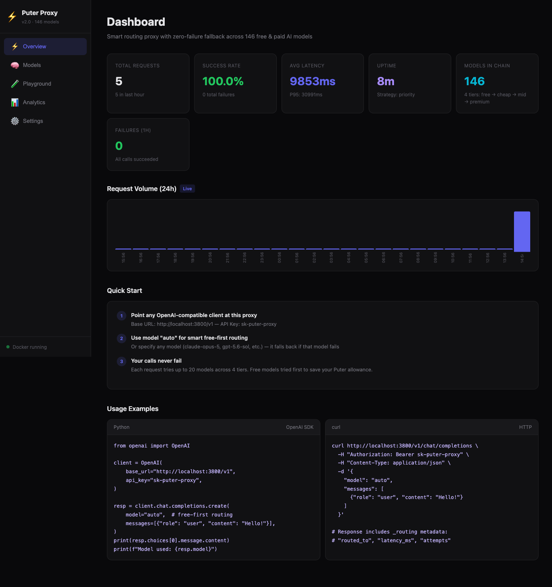
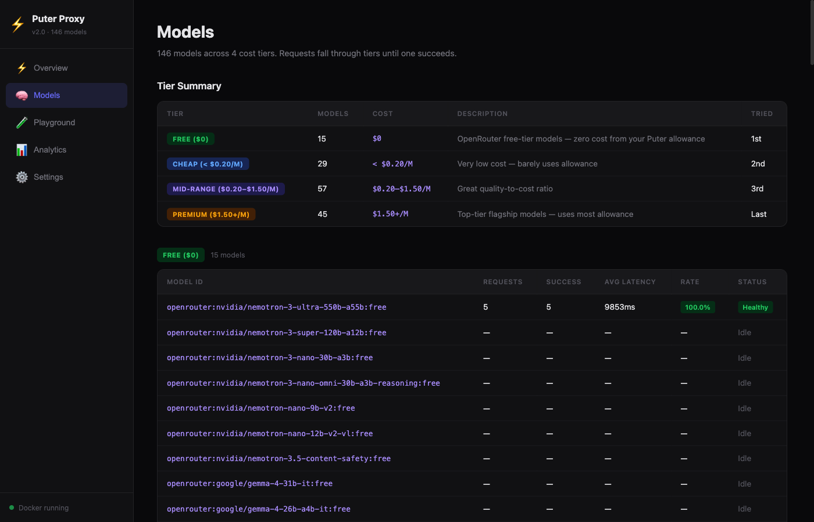
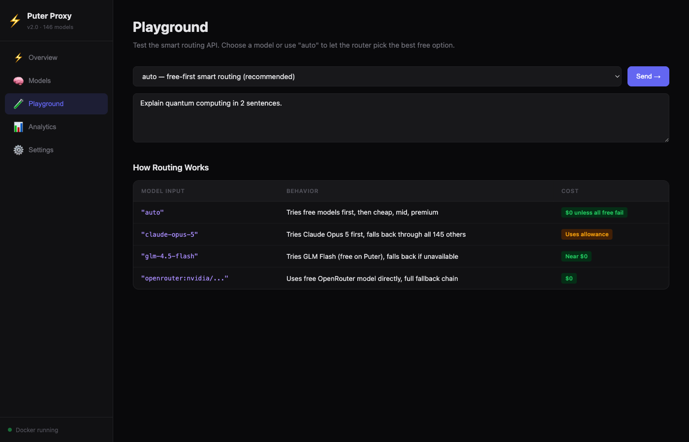
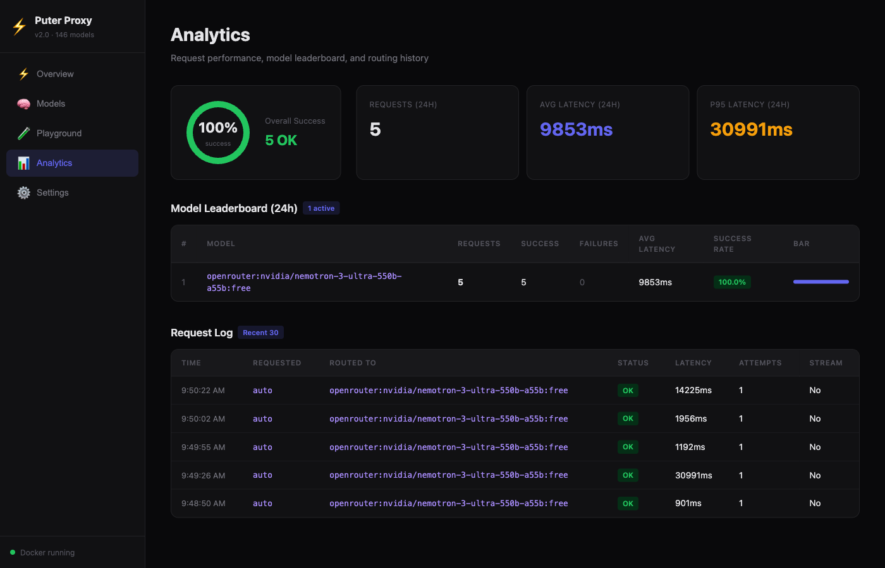

# ⚡ Puter API Proxy

**One endpoint. 424 models. Smart fallback. Near-zero cost.**

An OpenAI-compatible API proxy powered by [Puter.js](https://puter.com) that routes requests across 424 AI models (GPT-5.6, Claude Opus 5, Gemini 3.5, Grok 4.5, DeepSeek V4, Qwen3, and more) with automatic fallback. If one model fails, it instantly tries the next — up to 20 models per request across 4 cost tiers.

**15 models are completely free** (via OpenRouter). The rest use your Puter account's monthly allowance. Default routing tries free models first to minimize cost.

---

## 🎯 How It Works

```
Your App  →  Puter Proxy  →  146 models in fallback chain
              ↓ fail?
              Try next model automatically
              ↓ fail again?
              Keep trying (up to 20 models, 30s budget)
              ↓
              Response returned
```

| Tier | Models | Cost | Tried |
|------|--------|------|-------|
| 🆓 Free | 15 | $0 (OpenRouter) | 1st |
| 💰 Cheap | 28 | < $0.20/M tokens | 2nd |
| 🧠 Mid | 55 | $0.20–$1.50/M | 3rd |
| 👑 Premium | 48 | $1.50+/M | Last |

---

## 🚀 Quick Start

### 1️⃣ Get Your Puter Token (free)

Go to **https://puter.com/dashboard** → Sign up → Copy your auth token.

### 2️⃣ Clone & Run

```bash
git clone https://github.com/dhannu535/puter-api-proxy.git
cd puter-api-proxy
npm install
```

### 3️⃣ Set Your Token

```bash
cp .env.example .env
# Edit .env and paste your PUTER_AUTH_TOKEN
```

### 4️⃣ Start the Server

```bash
npm start
```

Your proxy is live at `http://localhost:3800` 🎉

---

## 🐳 Docker

```bash
# Start
docker compose up -d

# View logs
docker compose logs -f

# Stop
docker compose down

# Rebuild after changes
docker compose up -d --build
```

---

## 🔌 Usage

### Python

```python
from openai import OpenAI

client = OpenAI(
    base_url="http://localhost:3800/v1",
    api_key="sk-puter-proxy",
)

resp = client.chat.completions.create(
    model="auto",  # free-first smart routing
    messages=[{"role": "user", "content": "Hello!"}],
)

print(resp.choices[0].message.content)
print(f"Model used: {resp.model}")
```

### Node.js

```javascript
import OpenAI from "openai";

const client = new OpenAI({
  baseURL: "http://localhost:3800/v1",
  apiKey: "sk-puter-proxy",
});

const resp = await client.chat.completions.create({
  model: "auto",
  messages: [{ role: "user", content: "Hello!" }],
});

console.log(resp.choices[0].message.content);
```

### curl

```bash
curl http://localhost:3800/v1/chat/completions \
  -H "Authorization: Bearer sk-puter-proxy" \
  -H "Content-Type: application/json" \
  -d '{
    "model": "auto",
    "messages": [{"role": "user", "content": "Hello!"}]
  }'
```

---

## 🧩 Compatible Clients

| Client | Setup |
|--------|-------|
| 🐍 **Python OpenAI SDK** | `base_url="http://localhost:3800/v1"` |
| 📦 **Node.js OpenAI SDK** | `baseURL: "http://localhost:3800/v1"` |
| 🦜 **LangChain** | `ChatOpenAI(base_url="http://localhost:3800/v1")` |
| 💻 **Cursor** | Settings → OpenAI API Base → `http://localhost:3800/v1` |
| 🔧 **Cline / Roo Code** | Provider: OpenAI Compatible, Base URL: `http://localhost:3800/v1` |
| ▶️ **Continue** | `apiBase: http://localhost:3800/v1` |
| 🛠️ **Aider** | `OPENAI_API_BASE=http://localhost:3800/v1 aider` |
| 🤖 **Claude Code** | `ANTHROPIC_BASE_URL=http://localhost:3800 ANTHROPIC_AUTH_TOKEN=sk-puter-proxy claude` |
| 📟 **Codex CLI** | `OPENAI_BASE_URL=http://localhost:3800/v1 OPENAI_API_KEY=sk-puter-proxy codex` |
| ⚡ **Hermes** | `OPENAI_API_BASE=http://localhost:3800/v1 OPENAI_API_KEY=sk-puter-proxy hermes` |

---

## 🎛️ Model Selection

| Model Input | Behavior | Cost |
|-------------|----------|------|
| `"auto"` | Free models first, then escalates | 💚 $0 unless all free fail |
| `"claude-opus-5"` | Tries Claude first, falls back through all others | 💛 Uses allowance |
| `"glm-4.5-flash"` | Tries GLM Flash (free on Puter) | 💚 ~$0 |
| `"openrouter:nvidia/nemotron-3-ultra-550b-a55b:free"` | Free OpenRouter model | 💚 $0 |

---

## 🆓 Free Models (Zero Cost)

These are tried first — your Puter allowance stays untouched:

| Model | Size | Provider |
|-------|------|----------|
| NVIDIA Nemotron Ultra | 550B | OpenRouter |
| NVIDIA Nemotron Super | 120B | OpenRouter |
| NVIDIA Nemotron Nano | 30B | OpenRouter |
| Google Gemma 4 | 31B | OpenRouter |
| Poolside Laguna M.1 | 225B | OpenRouter |
| Poolside Laguna S 2.1 | 118B | OpenRouter |
| OpenAI GPT-OSS | 20B | OpenRouter |
| InclusionAI Ling 3.0 Flash | 124B | OpenRouter |
| Cohere North Mini Code | 30B | OpenRouter |

---

## 🛡️ Fallback Logic

1. Request comes in (`model: "auto"` or specific)
2. Router tries **free** models first
3. On failure → instantly tries next model in chain
4. Escalates: free → cheap → mid → premium
5. Up to **20 models** tried, **30s** time budget
6. Models that fail 3x get **60s cooldown** (auto-skipped)
7. **Sticky sessions** keep multi-turn chats on same model (30min TTL)

---

## 📊 Dashboard

Open **http://localhost:3800/dashboard** for:

- 📈 Request volume chart (24h)
- 🍩 Success rate donut chart
- 📋 Model leaderboard with per-model stats
- 🧪 Interactive playground to test models
- 📜 Request log with routing details
- ⚙️ Strategy picker & configuration

### Screenshots

**Overview** — Stats, charts, quick start guide


**Models** — All 146 models across 4 tiers with health status


**Playground** — Test any model with live routing info


**Analytics** — Success rate, leaderboard, request log


---

## ⚙️ Configuration

### Environment Variables

| Variable | Default | Description |
|----------|---------|-------------|
| `PUTER_AUTH_TOKEN` | *required* | Your token from puter.com/dashboard |
| `PORT` | `3800` | Server port |
| `API_KEY` | `sk-puter-proxy` | Auth key for your proxy (`"none"` to disable) |
| `DASHBOARD` | `true` | Enable/disable dashboard |

### Routing Strategies

| Strategy | Description |
|----------|-------------|
| 💚 `free_first` | Free → Cheap → Mid → Premium (default) |
| ⚖️ `balanced` | Spread load across free + cheap tiers |
| ⭐ `quality` | Premium first (uses most allowance) |
| 🧠 `smart` | Auto-detect complexity |

```bash
# Change strategy via API
curl -X POST http://localhost:3800/api/config \
  -H "Content-Type: application/json" \
  -d '{"strategy": "free_first"}'
```

---

## 📡 API Endpoints

| Endpoint | Method | Description |
|----------|--------|-------------|
| `/v1/chat/completions` | POST | OpenAI chat completions |
| `/v1/messages` | POST | Anthropic Messages API (Claude Code) |
| `/v1/responses` | POST | Responses API (Codex CLI) |
| `/v1/models` | GET | List all 424 available models |
| `/health` | GET | Health check + uptime |
| `/dashboard` | GET | Admin dashboard UI |
| `/api/stats` | GET | Analytics summary |
| `/api/models` | GET | Per-model performance stats |
| `/api/config` | GET/POST | View/update routing config |
| `/api/cooldowns/clear` | POST | Reset all model cooldowns |

---

## 📁 Project Structure

```
puter-api-proxy/
├── server/
│   ├── index.mjs        # HTTP server + all API routes
│   ├── router.mjs       # Smart routing with fallback
│   ├── models.mjs       # 146 models in 4 cost tiers
│   └── analytics.mjs    # In-memory request tracking
├── dashboard/
│   └── src/             # React dashboard (Vite)
├── Dockerfile           # Multi-stage Alpine build
├── docker-compose.yml   # One-command deployment
├── .env.example         # Configuration template
└── package.json
```

---

## 📝 License

MIT
